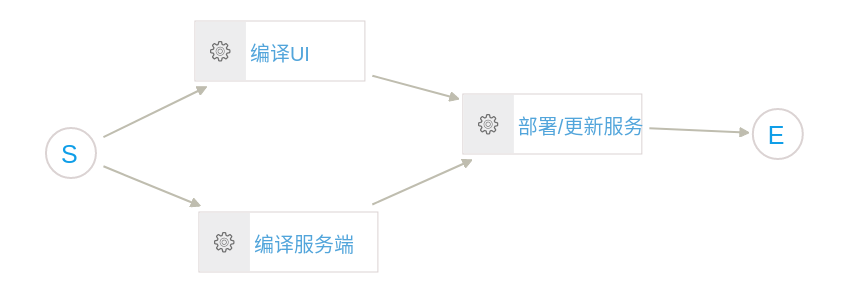
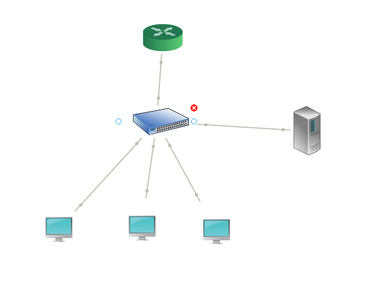

## topoflow

#### 基础概念说明

- 节点(node)为实际的场景中的逻辑实例,例如网络中的一台交换机,路由器,防火墙等等.

- 线(link):关联两个节点,并维护两个节点之间的关系.

  ​

#### 功能说明

topoflow是一个基于[d3](https://d3js.org/)的一个拓扑图插件,提供了以下功能.

1. 通过画布可以拖拽节点.

2. 画布中两个节点之间可以连线.

3. 画布中的节点和线条可进行缩放和一定.

4. 提供了丰富的对外暴露的方法和事件,适用各种适用场景.

5. 针对每个节点提供了右键菜单,适用于不同节点类型.

   ​


目前该类的组件也有,但是很多无法满足各种需求,主要以下两点:

1. 并未提供丰富的方法和事件,使得使用场景单一.
2. 样式无法修改.

该项目是根据本人的在多个实际项目需求开发,并将其开源,因本人时间和能力有限,可能会存在些许bug,欢迎提交issues.


#### 使用例子






#### 使用说明

亲测,适用于`react`和`vue`

- react项目中初始化过程应该在`componentDidMount` 生命周期内完成

- vue项目中的初始化过程应该在`mounted`的生命周期内完成

  ​


- 安装依赖

```bash
npm i topoflow --save-dev
```

- html

```html
<div id="topoflow"></div>
```

- 初始化

```js
import TopoFlow from 'topoflow';

let data = {
    nodes: [{
        id: 'router1',
        type: 'router',
        templateType: 'router',
        shape: 'rect',
        x: 300,
        y: 150,
        height: 50,
        width: 90,
        config: {
            type: 'router',
            name: 'router11',
        }
    }, {
        id: 'switch2',
        type: 'switch',
        templateType: 'switch',
        shape: 'rect',
        x: 300,
        y: 300,
        height: 50,
        width: 140,
        config: {
            type: 'switch',
            name: 'router2',
        }
    }],
    links: [{
        from: 'router1',
        to: 'switch2'
    }]
};

let config = {
    eln: '#topoflow',        // 画布节点的ID
    width: '100%',
    height: '700px',
    data: data,
    // 节点模板
    template: {
        // router 类型的模板
        router: {
            shape: 'rect',
            deleteAble: true,                       // 是否可删除
            operatingPoint: ['left', 'right'],      // 连线操作的点出现位置 
            node: (node, nodeInfo) => {             // 节点渲染的方法, node为d3的对象,nodeInfo 为节点的数据配置
                node.append('svg:image')
                    .attr('href', 'static/images/ovn/router.png')
                    .attr('height', nodeInfo.height)
                    .attr('width', nodeInfo.width)
            }
        },
        switch: {
            shape: 'rect',
            deleteAble: true,
            operatingPoint: ['left', 'right'],
            node: (node, nodeInfo) => {
                node.append('svg:image')
                    .attr('href', 'static/images/ovn/switch.png')
                    .attr('height', nodeInfo.height)
                    .attr('width', nodeInfo.width)
            }
        }
    },
    onSelectNode: (eln, node) => {
        // 当某个节点选中时触发
    },
    onClearActiveElement: () => {
        // 清除当前选中的节点事件
    },

    onNodeContextMenuRender: (nodeInfo) => {
        // 节点的右键菜单显示项
        return [{
            label: '配置', action: 'h_setup'
        }, {
            label: '详情', action: 'h_detail'
        }];
    },
    contextmenuClick: (node, action) => {
        // node 节点的数据信息
        // node 节点的数据信息        
    },
    onChange: (data) => {
        // 当拓扑图数据发生变更的时候触发该方法        
    },
};

let topoflow = new TopoFlow(config);
```


- 方法说明

```js
// 更新图形
topoflow.setData(newData);

// 选中某个节点
topoflow.selectNode(nodeID);

// 新增线条
topoflow.addLink(linkInfo);

// 新增节点
topoflow.addNode(nodeInfo);

// 获取当前的节点
topoflow.getNodes();
// 获取当前的线
topoflow.getLinks();
```

